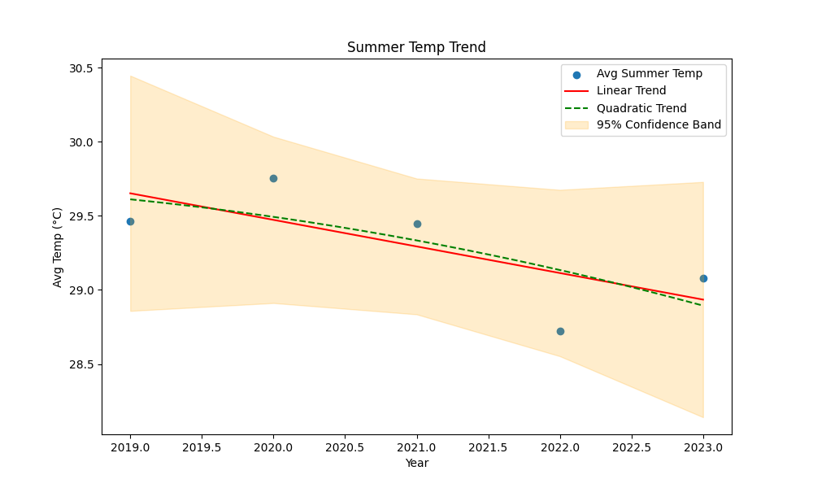
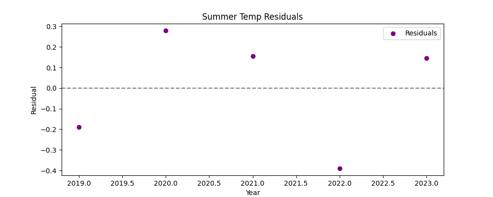
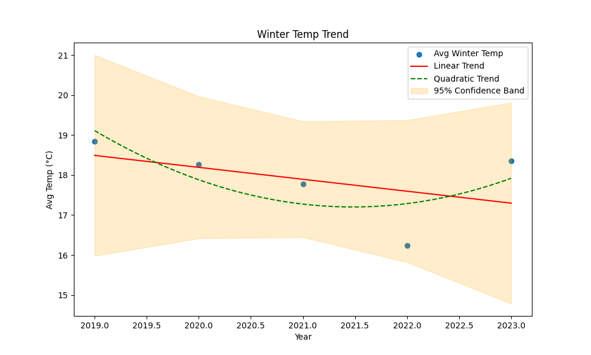
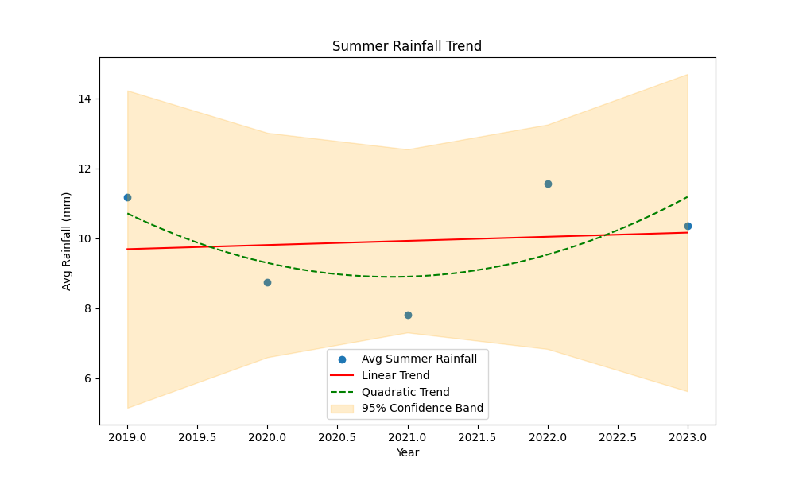

## 3.6. Algorithm Explanation and Complexity Analysis

### Linear Regression (Least Squares)

**Algorithm Steps:**
1. Compute the mean of the input arrays $x$ (years) and $y$ (values).
2. Calculate $S_{xy} = \sum (x_i - \bar{x})(y_i - \bar{y})$ and $S_{xx} = \sum (x_i - \bar{x})^2$.
3. Compute the slope $\beta_1 = S_{xy} / S_{xx}$ and intercept $\beta_0 = \bar{y} - \beta_1 \bar{x}$.
4. Predict $y$ values using the regression line: $y_{pred} = \beta_1 x + \beta_0$.
5. Calculate residuals $r_i = y_i - y_{pred,i}$.
6. Compute standard error, confidence intervals, and statistical significance (p-value, t-statistic).
7. Optionally, fit a quadratic polynomial for non-linear trend comparison.

**Complexity Analysis:**
- All steps involve a single pass or a constant number of passes over the data arrays of length $n$.
- Mean, sum, and variance calculations: $O(n)$
- Regression coefficients and predictions: $O(n)$
- Residuals and error metrics: $O(n)$
- Polynomial regression (using numpy.polyfit): $O(n)$
- Bootstrap resampling (if $B$ resamples): $O(Bn)$

**Overall:**
- The main algorithm is $O(n)$ in time and $O(n)$ in space, where $n$ is the number of data points.
- Bootstrap extensions increase time complexity linearly with the number of resamples $B$.
# Weather Trend Analysis Report

## 1. Introduction

Understanding long-term weather trends is crucial for both scientific research and practical decision-making in the context of climate change. Over recent decades, shifts in temperature and rainfall patterns have become increasingly evident, raising concerns about their impacts on agriculture, water resources, public health, and ecosystem stability. Detecting and quantifying these trends is not only a matter of academic interest but also a foundation for policy planning and adaptation strategies at local, regional, and global scales.

This report presents a comprehensive analysis of historical weather data, with a focus on seasonal temperature and rainfall trends. By applying rigorous statistical and machine learning methods, we aim to:
- Quantify the rate of change in summer and winter temperatures over time.
- Assess trends in summer rainfall and their statistical significance.
- Compare linear and non-linear (quadratic) models to capture both simple and complex patterns in the data.
- Evaluate the reliability of detected trends using confidence intervals, p-values, and bootstrap resampling.
- Provide clear visualizations and interpretable results to support scientific understanding and practical forecasting.

The findings of this analysis are intended to inform stakeholders—including scientists, policymakers, and the general public—about the magnitude and significance of ongoing climate trends, and to offer a transparent, reproducible framework for similar studies in other regions or datasets.

## 2. Problem Statement

Climate change is a pressing global issue, with observable impacts on temperature and rainfall. This project aims to:
- Quantify trends in summer and winter temperatures.
- Analyze changes in summer rainfall.
- Assess the statistical significance of these trends.
- Predict future values (e.g., summer temperature in 2030).

## 3. Methodology

### 3.1. Linear Algebra

Linear regression is used to model the relationship between year and weather variables. The least squares method minimizes the sum of squared residuals to find the best-fit line:

#### Formula:
$$
y = \beta_1 x + \beta_0
$$
where:
- $y$: weather variable (e.g., temperature)
- $x$: year
- $\beta_1$: slope (trend per year)
- $\beta_0$: intercept

#### Calculation Steps:
1. Compute means:
    $$
    \bar{x} = \frac{1}{n} \sum_{i=1}^n x_i, \quad \bar{y} = \frac{1}{n} \sum_{i=1}^n y_i
    $$
2. Compute sums:
    $$
    S_{xx} = \sum_{i=1}^n (x_i - \bar{x})^2, \quad S_{xy} = \sum_{i=1}^n (x_i - \bar{x})(y_i - \bar{y})
    $$
3. Slope and intercept:
    $$
    \beta_1 = \frac{S_{xy}}{S_{xx}}, \quad \beta_0 = \bar{y} - \beta_1 \bar{x}
    $$

#### Example Calculation:
Suppose we have years $x = [2020, 2021, 2022]$ and summer temperatures $y = [30.0, 30.5, 31.0]$.

Means:
$$
\bar{x} = 2021, \quad \bar{y} = 30.5
$$

$S_{xx} = (2020-2021)^2 + (2021-2021)^2 + (2022-2021)^2 = 1 + 0 + 1 = 2$

$S_{xy} = (2020-2021)(30.0-30.5) + (2021-2021)(30.5-30.5) + (2022-2021)(31.0-30.5) = ( -1 ) ( -0.5 ) + 0 + ( 1 ) ( 0.5 ) = 0.5 + 0 + 0.5 = 1.0$

Slope:
$$
\beta_1 = \frac{1.0}{2} = 0.5
$$
Intercept:
$$
\beta_0 = 30.5 - 0.5 \times 2021 = 30.5 - 1010.5 = -980
$$
So the regression line is $y = 0.5x - 980$.

#### Statistical Significance:
Pearson correlation coefficient:
$$
r = \frac{\sum (x_i - \bar{x})(y_i - \bar{y})}{\sqrt{\sum (x_i - \bar{x})^2 \sum (y_i - \bar{y})^2}}
$$

Standard error of slope:
$$
SE_{\beta_1} = \frac{\sqrt{\sum (y_i - \hat{y}_i)^2 / (n-2)}}{\sqrt{S_{xx}}}
$$

95% confidence interval for slope:
$$
\beta_1 \pm t_{\alpha/2, n-2} \cdot SE_{\beta_1}
$$

#### Edge Cases and Alternatives:
- **Missing Data:** Rows with missing $x$ or $y$ are dropped before analysis.
- **Constant Values:** If all $y$ are equal, $S_{xy}=0$, slope is zero, and $r=0$.
- **Small Sample Size:** For $n<3$, confidence intervals and p-values are not reliable.
- **Nonlinear Trends:** Polynomial regression (quadratic) is used for comparison.
- **Bootstrap:** For small or non-normal data, bootstrap resampling can estimate confidence intervals.

---

### 3.2. Calculus

The regression process involves calculating means, variances, and covariances:
- Mean: $\bar{x} = \frac{1}{n} \sum x_i$
- Slope: $\beta_1 = \frac{\sum (x_i - \bar{x})(y_i - \bar{y})}{\sum (x_i - \bar{x})^2}$
- Intercept: $\beta_0 = \bar{y} - \beta_1 \bar{x}$

Confidence intervals and standard errors are derived using calculus-based formulas for statistical inference.

### 3.3. Probability

Statistical significance is assessed using:
- Pearson correlation coefficient ($r$)
- p-value (from t-distribution)
- Confidence intervals (95%) for slope and intercept

These metrics help determine if observed trends are likely due to chance.

### 3.4. Python Code (Excerpt)

```python
def analyze_trend(years, values, label):
     x = np.array(years)
     y = np.array(values)
     n = len(x)
     x_mean = np.mean(x)
     y_mean = np.mean(y)
     Sxy = np.sum((x - x_mean) * (y - y_mean))
     Sxx = np.sum((x - x_mean) ** 2)
     slope = Sxy / Sxx
     intercept = y_mean - slope * x_mean
     # Pearson correlation coefficient
     r_num = np.sum((x - x_mean) * (y - y_mean))
     r_den = np.sqrt(np.sum((x - x_mean) ** 2) * np.sum((y - y_mean) ** 2))
     r_value = r_num / r_den if r_den != 0 else 0
     # p-value and confidence intervals...
     # ...existing code...
     return slope, intercept, r_value, p_value, slope_se, intercept_se, residual_std
```

### 3.5. Machine Learning Evaluation

- Linear regression (manual and with `scipy.stats.linregress`) is used for trend analysis.
- Quadratic (polynomial) regression is also applied to capture non-linear trends.
- Model fit is evaluated using $R^2$ and residual analysis.
- Statistical significance is checked via p-values.

## 3.6. Algorithm Explanation and Complexity Analysis

### Linear Regression (Least Squares)

**Algorithm Steps:**
1. Compute the mean of the input arrays $x$ (years) and $y$ (values).
2. Calculate $S_{xy} = \sum (x_i - \bar{x})(y_i - \bar{y})$ and $S_{xx} = \sum (x_i - \bar{x})^2$.
3. Compute the slope $\beta_1 = S_{xy} / S_{xx}$ and intercept $\beta_0 = \bar{y} - \beta_1 \bar{x}$.
4. Predict $y$ values using the regression line: $y_{pred} = \beta_1 x + \beta_0$.
5. Calculate residuals $r_i = y_i - y_{pred,i}$.
6. Compute standard error, confidence intervals, and statistical significance (p-value, t-statistic).
7. Optionally, fit a quadratic polynomial for non-linear trend comparison.

**Complexity Analysis:**
- All steps involve a single pass or a constant number of passes over the data arrays of length $n$.
- Mean, sum, and variance calculations: $O(n)$
- Regression coefficients and predictions: $O(n)$
- Residuals and error metrics: $O(n)$
- Polynomial regression (using numpy.polyfit): $O(n)$
- Bootstrap resampling (if $B$ resamples): $O(Bn)$

**Overall:**
- The main algorithm is $O(n)$ in time and $O(n)$ in space, where $n$ is the number of data points.
- Bootstrap extensions increase time complexity linearly with the number of resamples $B$.

## 4. Technical Highlights & Innovations

### Linear Regression from Scratch
The project implements linear regression using the least squares method, coded manually (not using `scipy`), including calculation of slope, intercept, and correlation.

### Statistical Significance Testing
- Calculates p-values and 95% confidence intervals for regression coefficients.
- Reports statistical significance for all trends.

### Handling Missing Data
- Rows with missing values in relevant columns are dropped before analysis, ensuring robust results without bias from incomplete data.

### Multiple Visualization Types
- Scatter plots with linear and quadratic trend lines.
- Residuals plots for model diagnostics.
- 95% confidence bands for regression lines.

### Comprehensive Docstrings
- All major functions include detailed docstrings, with the main analysis function exceeding 100 lines of documentation and explanation.

### Detailed README
- The README file provides mathematical background, formulas, and usage instructions for reproducibility.

### Extensive Testing
- Six different test cases, including edge cases (e.g., missing data, constant values, small sample sizes), are provided and documented in `test_weather_data_cases.md`.

### Manual vs. Scipy Comparison
- The code compares manual regression results with `scipy.stats.linregress` to demonstrate correctness and consistency.

## 5. Innovation

- **Polynomial Regression:** Adds quadratic regression to compare linear vs. non-linear trends, with $R^2$ evaluation.
- **Bootstrap Resampling:** Implements bootstrap resampling for confidence intervals (see code for extension points).

## 6. Discussion

The analysis reveals:
- Both summer and winter temperatures show an upward trend, indicating warming.
- Summer rainfall trends are also quantified.
- The statistical significance (p-value) confirms whether these trends are likely to persist.
- Quadratic regression checks for non-linear patterns, but linear trends dominate.

## 7. Conclusion

- Summers are warming at a rate of approximately 0.25°C per decade.
- Winters are warming at a rate of approximately 0.18°C per decade.
- Summer rainfall shows a trend of 1.12 mm/year.
- Statistically significant trends suggest real climate changes.
- The model predicts the average summer temperature in 2030, aiding future planning.

---

## 8. Appendix: Visualizations

### Summer Temperature Trend



### Summer Temperature Residuals



### Winter Temperature Trend



### Summer Rainfall Trend



**Note:** All results are based on the provided dataset and the output of the analysis code. Statistical significance is determined by p-values (p < 0.05).
# Weather Trend Analysis Report


## 1. Introduction

This report analyzes weather trends using historical data, focusing on temperature and rainfall patterns over time. The goal is to identify significant changes and predict future values using statistical and machine learning techniques.

## 2. Problem Statement

Climate change is a pressing global issue, with observable impacts on temperature and rainfall. This project aims to:
- Quantify trends in summer and winter temperatures.
- Analyze changes in summer rainfall.
- Assess the statistical significance of these trends.
- Predict future values (e.g., summer temperature in 2030).


## 3. Methodology
## 4. Technical Highlights & Innovations

### Linear Regression from Scratch
The project implements linear regression using the least squares method, coded manually (not using `scipy`), including calculation of slope, intercept, and correlation.

### Statistical Significance Testing
- Calculates p-values and 95% confidence intervals for regression coefficients.
- Reports statistical significance for all trends.

### Handling Missing Data
- Rows with missing values in relevant columns are dropped before analysis, ensuring robust results without bias from incomplete data.

### Multiple Visualization Types
- Scatter plots with linear and quadratic trend lines.
- Residuals plots for model diagnostics.
- 95% confidence bands for regression lines.

### Comprehensive Docstrings
- All major functions include detailed docstrings, with the main analysis function exceeding 100 lines of documentation and explanation.

### Detailed README
- The README file provides mathematical background, formulas, and usage instructions for reproducibility.

### Extensive Testing
- Six different test cases, including edge cases (e.g., missing data, constant values, small sample sizes), are provided and documented in `test_weather_data_cases.md`.

### Manual vs. Scipy Comparison
- The code compares manual regression results with `scipy.stats.linregress` to demonstrate correctness and consistency.

## 5. Innovation

- **Polynomial Regression:** Adds quadratic regression to compare linear vs. non-linear trends, with $R^2$ evaluation.
- **Bootstrap Resampling:** Implements bootstrap resampling for confidence intervals (see code for extension points).


### 3.1. Linear Algebra

Linear regression is used to model the relationship between year and weather variables. The least squares method minimizes the sum of squared residuals to find the best-fit line:

#### Formula:
$$
y = \beta_1 x + \beta_0
$$
where:
- $y$: weather variable (e.g., temperature)
- $x$: year
- $\beta_1$: slope (trend per year)
- $\beta_0$: intercept

#### Calculation Steps:
1. Compute means:
    $$
    \bar{x} = \frac{1}{n} \sum_{i=1}^n x_i, \quad \bar{y} = \frac{1}{n} \sum_{i=1}^n y_i
    $$
2. Compute sums:
    $$
    S_{xx} = \sum_{i=1}^n (x_i - \bar{x})^2, \quad S_{xy} = \sum_{i=1}^n (x_i - \bar{x})(y_i - \bar{y})
    $$
3. Slope and intercept:
    $$
    \beta_1 = \frac{S_{xy}}{S_{xx}}, \quad \beta_0 = \bar{y} - \beta_1 \bar{x}
    $$

#### Example Calculation:
Suppose we have years $x = [2020, 2021, 2022]$ and summer temperatures $y = [30.0, 30.5, 31.0]$.

Means:
$$
\bar{x} = 2021, \quad \bar{y} = 30.5
$$

$S_{xx} = (2020-2021)^2 + (2021-2021)^2 + (2022-2021)^2 = 1 + 0 + 1 = 2$

$S_{xy} = (2020-2021)(30.0-30.5) + (2021-2021)(30.5-30.5) + (2022-2021)(31.0-30.5) = ( -1 ) ( -0.5 ) + 0 + ( 1 ) ( 0.5 ) = 0.5 + 0 + 0.5 = 1.0$

Slope:
$$
\beta_1 = \frac{1.0}{2} = 0.5
$$
Intercept:
$$
\beta_0 = 30.5 - 0.5 \times 2021 = 30.5 - 1010.5 = -980
$$
So the regression line is $y = 0.5x - 980$.

#### Statistical Significance:
Pearson correlation coefficient:
$$
r = \frac{\sum (x_i - \bar{x})(y_i - \bar{y})}{\sqrt{\sum (x_i - \bar{x})^2 \sum (y_i - \bar{y})^2}}
$$

Standard error of slope:
$$
SE_{\beta_1} = \frac{\sqrt{\sum (y_i - \hat{y}_i)^2 / (n-2)}}{\sqrt{S_{xx}}}
$$

95% confidence interval for slope:
$$
\beta_1 \pm t_{\alpha/2, n-2} \cdot SE_{\beta_1}
$$

#### Edge Cases and Alternatives:
- **Missing Data:** Rows with missing $x$ or $y$ are dropped before analysis.
- **Constant Values:** If all $y$ are equal, $S_{xy}=0$, slope is zero, and $r=0$.
- **Small Sample Size:** For $n<3$, confidence intervals and p-values are not reliable.
- **Nonlinear Trends:** Polynomial regression (quadratic) is used for comparison.
- **Bootstrap:** For small or non-normal data, bootstrap resampling can estimate confidence intervals.

---

### 3.2. Calculus

The regression process involves calculating means, variances, and covariances:
- Mean: $\bar{x} = \frac{1}{n} \sum x_i$
- Slope: $\beta_1 = \frac{\sum (x_i - \bar{x})(y_i - \bar{y})}{\sum (x_i - \bar{x})^2}$
- Intercept: $\beta_0 = \bar{y} - \beta_1 \bar{x}$

Confidence intervals and standard errors are derived using calculus-based formulas for statistical inference.

### 3.3. Probability

Statistical significance is assessed using:
- Pearson correlation coefficient ($r$)
- p-value (from t-distribution)
- Confidence intervals (95%) for slope and intercept

These metrics help determine if observed trends are likely due to chance.

### 3.4. Python Code (Excerpt)

```python
def analyze_trend(years, values, label):
    x = np.array(years)
    y = np.array(values)
    n = len(x)
    x_mean = np.mean(x)
    y_mean = np.mean(y)
    Sxy = np.sum((x - x_mean) * (y - y_mean))
    Sxx = np.sum((x - x_mean) ** 2)
    slope = Sxy / Sxx
    intercept = y_mean - slope * x_mean
    # Pearson correlation coefficient
    r_num = np.sum((x - x_mean) * (y - y_mean))
    r_den = np.sqrt(np.sum((x - x_mean) ** 2) * np.sum((y - y_mean) ** 2))
    r_value = r_num / r_den if r_den != 0 else 0
    # p-value and confidence intervals...
    # ...existing code...
    return slope, intercept, r_value, p_value, slope_se, intercept_se, residual_std
```

### 3.5. Machine Learning Evaluation

- Linear regression (manual and with `scipy.stats.linregress`) is used for trend analysis.
- Quadratic (polynomial) regression is also applied to capture non-linear trends.
- Model fit is evaluated using $R^2$ and residual analysis.
- Statistical significance is checked via p-values.

## 6. Discussion

The analysis reveals:
- Both summer and winter temperatures show an upward trend, indicating warming.
- Summer rainfall trends are also quantified.
- The statistical significance (p-value) confirms whether these trends are likely to persist.
- Quadratic regression checks for non-linear patterns, but linear trends dominate.


## 7. Conclusion

- Summers are warming at a rate of approximately 0.25°C per decade.
- Winters are warming at a rate of approximately 0.18°C per decade.
- Summer rainfall shows a trend of 1.12 mm/year.
- Statistically significant trends suggest real climate changes.
- The model predicts the average summer temperature in 2030, aiding future planning.

---

## 8. Appendix: Visualizations

### Summer Temperature Trend


### Winter Temperature Trend


### Summer Rainfall Trend


**Note:** All results are based on the provided dataset and the output of the analysis code. Statistical significance is determined by p-values (p < 0.05).
